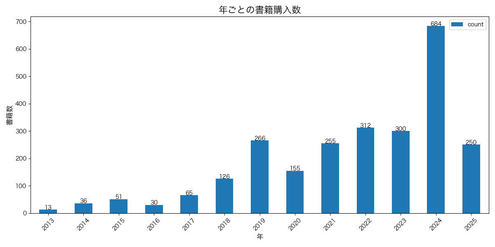
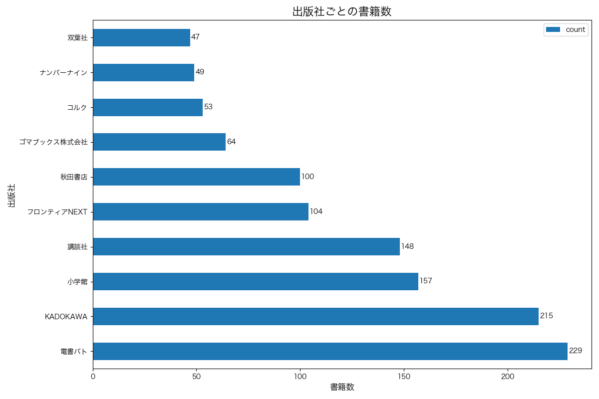
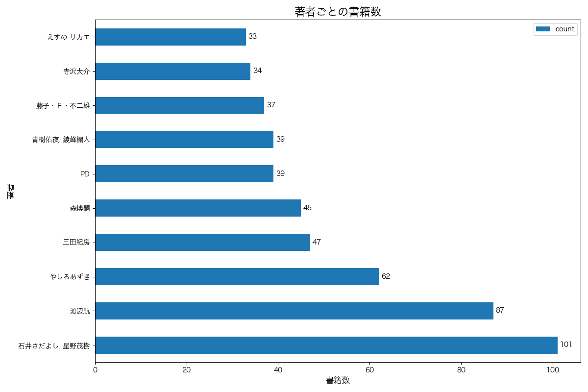
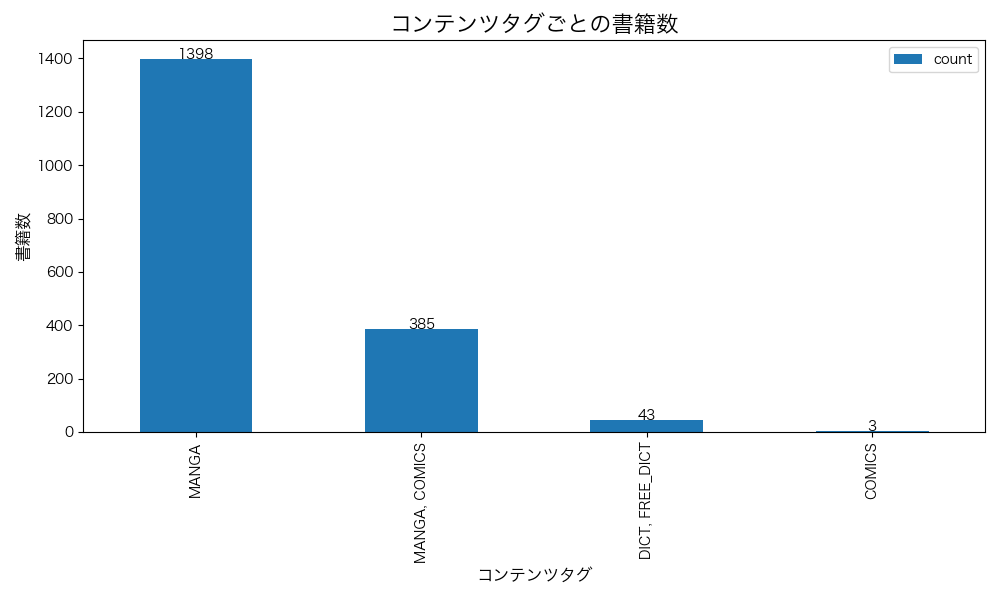
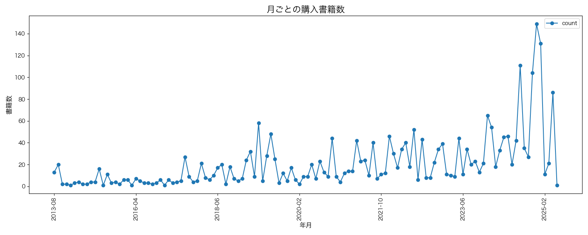

# Kindle Analyzer

Kindleの蔵書情報を分析・可視化するためのツールです。

## 概要

このリポジトリは、Kindleの蔵書情報をSQLiteデータベースから読み取り、分析および可視化するためのツールを提供します。年ごとの購入数、出版社ごとの書籍数、著者ごとの書籍数など、様々な観点からKindleの蔵書情報を分析することができます。

## 機能

- Kindleの蔵書情報をSQLiteデータベースから読み取り
- 年ごとの書籍購入数の分析
- 出版社ごとの書籍数の分析
- 著者ごとの書籍数の分析
- コンテンツタグごとの書籍数の分析
- 月ごとの購入書籍数の分析
- 分析結果の可視化（グラフの生成）
- マークダウン形式での書籍リスト出力
- Jupyter Notebookによる対話的な分析環境

## 環境のセットアップ

### 前提条件

- Python 3.8以上
- [uv](https://github.com/astral-sh/uv)（高速なPythonパッケージマネージャー）
- tkinter（グラフ表示用、インストールしない場合は一部機能に制限あり）
  - macOS: `brew install python-tk`
  - Ubuntu: `sudo apt-get install python3-tk`
  - Windows: 通常はPythonインストール時に含まれています。含まれていない場合はPythonインストーラーを再実行して「tcl/tk and IDLE」オプションを選択してください。

### セットアップ手順

1. リポジトリをクローン

```bash
git clone https://github.com/karaage0703/kindle-analyzer.git
cd kindle-analyzer
```

2. uvで仮想環境を作成

```bash
uv venv
```

3. 仮想環境をアクティベート

```bash
source .venv/bin/activate
```

4. 依存パッケージをインストール

```bash
uv pip install -r requirements.txt
```

## 使い方

### データベースファイルの準備

Kindleの蔵書情報は、以下の場所にあるSQLiteデータベースファイルに保存されています：

- Mac: `~/Library/Containers/com.amazon.Lassen/Data/Library/Protected/BookData.sqlite`

このファイルを`data`ディレクトリにコピーするか、直接パスを指定して使用します。

### コマンドラインツールの使用

```bash
# パッケージをインストールモードで実行
pip install -e .

# すべての分析を実行
kindle-analyzer --all

# 特定の分析のみ実行
kindle-analyzer --year --publisher

# データベースファイルのパスを指定
kindle-analyzer --db-path /path/to/BookData.sqlite

# 出力ディレクトリを指定
kindle-analyzer --output-dir ./my_analysis
```

オプション：
- `--db-path`, `-d`: SQLiteデータベースファイルのパス
- `--output-dir`, `-o`: 分析結果の出力ディレクトリ
- `--year`, `-y`: 年ごとの書籍数を分析
- `--publisher`, `-p`: 出版社ごとの書籍数を分析
- `--author`, `-a`: 著者ごとの書籍数を分析
- `--tag`, `-t`: コンテンツタグごとの書籍数を分析
- `--monthly`, `-m`: 月ごとの購入書籍数を分析
- `--all`: すべての分析を実行

### マークダウン形式での書籍リスト出力

書籍リストをマークダウン形式で出力するには、以下のコマンドを使用します：

```bash
# 基本的な使用方法
python -m src.kindle_analyzer.markdown_exporter --db-path data/BookData.sqlite --output output/kindle_books.md

# 著者名でソートして上位10冊のみを出力
python -m src.kindle_analyzer.markdown_exporter --db-path data/BookData.sqlite --output output/kindle_books_by_author.md --sort-by author --ascending --limit 10

# 購入日の新しい順にソート（デフォルト）
python -m src.kindle_analyzer.markdown_exporter --db-path data/BookData.sqlite --output output/kindle_books_recent.md
```

オプション：
- `--db-path`, `-d`: SQLiteデータベースファイルのパス（必須）
- `--output`, `-o`: 出力ファイルのパス（デフォルト: kindle_books.md）
- `--sort-by`, `-s`: ソートするカラム名（デフォルト: purchase_date）
  - 選択肢: title_from_metadata, author, publisher, purchase_date, publication_date
- `--ascending`, `-a`: 昇順にソートする（デフォルト: 降順）
- `--limit`, `-l`: 出力する書籍数の上限

出力されるマークダウンファイルには、各書籍のタイトル、著者、出版社、購入日、出版日、タグ（存在する場合）が含まれます。

### Jupyter Notebookの使用

対話的なデータ分析を行うには、Jupyter Notebookを使用します。

```bash
jupyter notebook notebooks/kindle_analysis.ipynb
```

## 分析例

### マークダウン形式での書籍リスト出力例

```markdown
# Kindle蔵書リスト

合計: 2543冊

## 1. 考えの育て方: 知的生産のデジタルカード法 (Knowledge Walkers Books)

- **著者**: 倉下忠憲
- **出版社**: 不明
- **購入日**: 2025-05-03
- **出版日**: 2023-10-25

---

## 2. Obsidianで"育てる"最強ノート術 —— あらゆる情報をつなげて整理しよう

- **著者**: 増井 敏克
- **出版社**: 技術評論社
- **購入日**: 2025-04-29
- **出版日**: 2023-10-18

---
```

### 年ごとの書籍購入数



### 出版社ごとの書籍数



### 著者ごとの書籍数



### コンテンツタグごとの書籍数



### 月ごとの購入書籍数



## 注意事項

- このツールは、Mac版Kindleの蔵書情報を分析するために開発されました。
- 巨大なデータを扱う場合は、メモリ使用量に注意してください。
- データベースファイルの構造が変更された場合、このツールが正常に動作しない可能性があります。

## 参考資料

- [Mac版Kindleの蔵書一覧情報をPythonで読む](https://note.com/abay_ksg/n/ne345750a61d7)
- [Kindleの蔵書情報をKindleアプリのXMLをパースして可視化する方法](https://zenn.dev/karaage0703/articles/3a163290a4bc26)

## ライセンス

このプロジェクトはMITライセンスの下で公開されています。詳細は[LICENSE](LICENSE)ファイルを参照してください。
